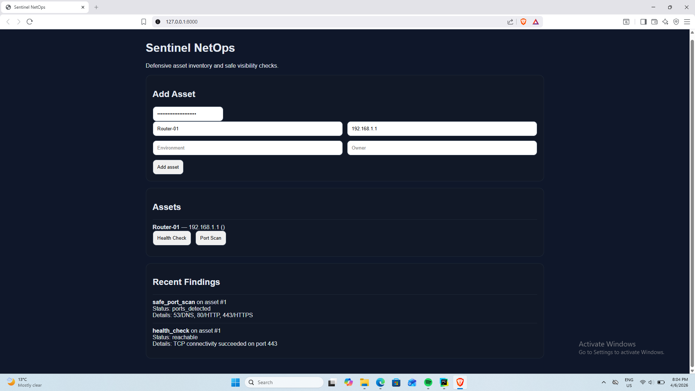

# Sentinel NetOps

## Overview
Sentinel NetOps is a Python-based network monitoring and port scanning tool.  
It allows scanning hosts, detecting open ports, and logging network activity.

## Why I built this
I wanted to simulate real-world network monitoring systems used in cybersecurity and IT operations.  
This project helped me understand sockets, async scanning, and how port scanning works at a low level.

## Features
- Host availability detection (ping simulation)
- Port scanning using sockets
- Asynchronous scanning (fast execution)
- Logging results to SQLite database

## Tech Stack
- Python
- asyncio
- sockets
- SQLite

## How to run
```bash
pip install -r requirements.txt
python main.py


## Screenshots


